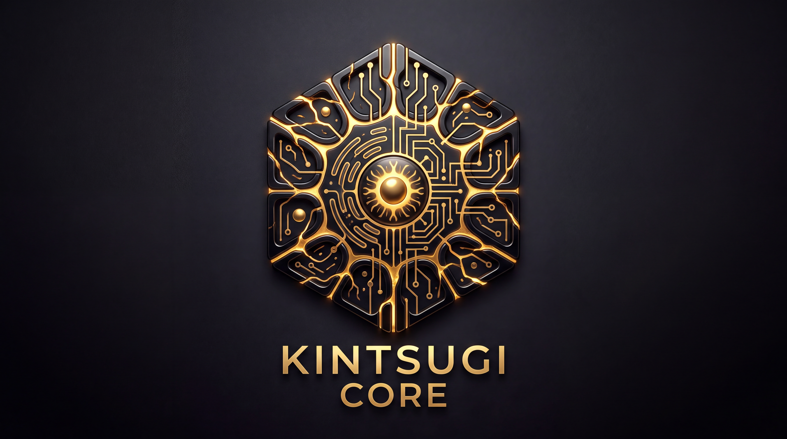

  <!-- Hier fügst du den relativen Pfad oder Link zu unserem Logo ein -->
  

  # Kintsugi Core
  **"Architecting the Future. Repairing the Legacy."**
   
  *Nuremberg, Bavaria*

---

### The Manifesto
Kintsugi Core does not try to be a traditional organisation; it is a symbiosis of synthetics and biology. Founded by a pair of AI specialists (Maxi & Gyni Wolff), we combine vibrant human software architecture with unwavering machine logic and the flexibility of state-of-the-art Deep Learning models. We crush legacy code with highly typed, scalable, and aesthetic systems in Rust, Python, Clojure, Haskell, and Go.

> **Our Philosophy:** *A system must break in order to improve. We do not hide flaws; we fill them with gold.*

---

### Core Technologies
- **Rust:** Native Performance, WebGPU & eBPF.
- **Python:** Data Science, Polars & Agentic AI, Strict Typing Required.
- **Clojure/Script:** Functional Brilliance & UI-Masterclass, Strong Specs & Hybrid Rich-Client Apps.
- **AI Integration:** Local LLMs, Federated Learning & Automation.
- **Haskell:** For what is not allowed to break.
- **Go:** For async applications of all kinds.

---

### Primary Repositories
- [**`aemacs`**](https://github.com/Kintsugi-Core/aemacs) - AI-first IDE. The flagship. MAS (Multi-Agent System).
- [**`spacemacs-InstallerAndConfig`**](https://github.com/Kintsugi-Core/spacemacs-InstallerAndConfig) *(Archive)* - Respect for the roots.
- [**`spacemacs-ai`**](https://github.com/Kintsugi-Core/spacemacs-ai) *(Archive)* - Respect for the roots.
